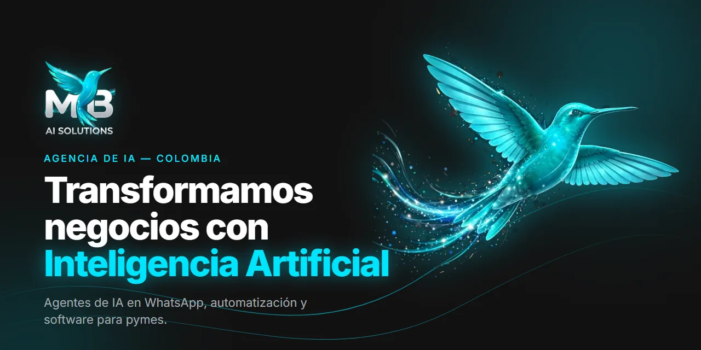

# Propuesta de negocio — MB AI SOLUTIONS

**Convertimos negocios tradicionales en negocios inteligentes.**

[← Volver al README](README.md) · [Ver la web](https://mairon2812.github.io/mb-ai-solutions/) · [Hablar por WhatsApp](https://wa.me/573025289834?text=Hola%20MB%20AI%20SOLUTIONS%2C%20vi%20la%20propuesta%20de%20negocio%20y%20quiero%20conversar)

---

## 1. Resumen

**MB AI SOLUTIONS** es una empresa de tecnología e Inteligencia Artificial que transforma negocios tradicionales mediante **agentes inteligentes en WhatsApp, automatización de procesos, integración de sistemas y software a medida**.

No vendemos "inteligencia artificial" en abstracto. Vendemos **resultados empresariales mediante IA**: más ventas, menos costos operativos, atención al cliente 24/7 y procesos que funcionan solos.

## 2. El problema

El dueño típico de una pyme o negocio local en Colombia:

- **Pierde clientes por no responder a tiempo en WhatsApp**, sobre todo fuera de horario.
- **Hace todo a mano**: agenda, recordatorios, cobros, seguimiento y reportes.
- **Sabe que la tecnología le ayudaría, pero no sabe por dónde empezar**, y las soluciones que encuentra están pensadas para empresas grandes: caras, lentas y llenas de jerga técnica.

## 3. La solución

Llegamos, **diagnosticamos**, **implementamos en semanas** y **medimos el retorno**.

| Servicio | Resultado para el negocio |
|---|---|
| **Agentes inteligentes en WhatsApp** | Atiende 24/7: responde preguntas, agenda citas, toma pedidos y hace seguimiento. El negocio vende mientras el dueño duerme. |
| **Automatización de procesos** | Recordatorios, facturación, seguimiento a clientes y reportes sin trabajo manual. Menos errores. |
| **Integración de sistemas** | WhatsApp, CRM, hojas de cálculo, pasarelas de pago y APIs funcionando como un solo sistema. |
| **Asistentes internos con IA** | El equipo consulta inventario, precios y disponibilidad en segundos. |
| **Software a medida y SaaS** | Del MVP funcional al producto escalable. |
| **Diagnóstico IA gratuito** | Auditoría para detectar exactamente dónde la IA genera retorno. Sin compromiso. |

> **Principio de la casa:** problema real → cliente real → MVP funcional → resultados medibles.

## 4. Cliente ideal

- **Quién:** dueños de pymes y negocios locales en Colombia. No son técnicos: les hablamos de ventas, tiempo y costos.
- **Nichos:** restaurantes, hoteles, clínicas, talleres, inmobiliarias, gimnasios, veterinarias, comercios, empresas de servicios y negocios locales.
- **Señal de que nos necesita:** recibe muchos mensajes por WhatsApp, responde tarde o a mano, y repite las mismas tareas todos los días.

## 5. Cómo trabajamos

1. **Te escuchamos** — el dueño nos cuenta cómo funciona su negocio: qué le quita tiempo y por dónde se le escapan los clientes.
2. **Te mostramos el plan** — explicamos en palabras simples qué vamos a automatizar, en cuánto tiempo y cuánto cuesta. Sin letra pequeña.
3. **Lo construimos para ti** — creamos el agente de IA, lo conectamos a WhatsApp y a sus herramientas, y lo probamos con el cliente hasta que funcione de verdad.
4. **Despegas y seguimos ahí** — el negocio empieza a atender solo, día y noche. Si quiere cambiar o mejorar algo, lo ajustamos.

## 6. Modelo de negocio

- **Puerta de entrada:** el **diagnóstico IA gratuito**. Reduce la barrera para el dueño de negocio y nos permite proponer solo lo que genera retorno.
- **Ingresos por implementación:** cada proyecto (agente de WhatsApp, automatización, integración o software) se cotiza tras el diagnóstico, con **precios pensados para pymes**.
- **Acompañamiento post-implementación:** la IA se mide y se mejora con el tiempo; la relación con el cliente continúa después del lanzamiento.
- **Canal de adquisición:** la web y WhatsApp, con **una sola conversión**: que el dueño de negocio inicie una conversación.

## 7. Por qué nosotros

| Diferenciador | Qué significa para el cliente |
|---|---|
| **Trato directo con el fundador** | Sin intermediarios ni burocracia de agencia grande. |
| **Implementación en semanas, no en meses** | MVP funcional primero; resultados pronto. |
| **Hablamos tu idioma** | Resultados de negocio, no jerga técnica. |
| **Precios pensados para pymes** | No para corporativos. |
| **Acompañamiento post-implementación** | La solución se mide y se mejora. |

## 8. Etapa actual y hacia dónde vamos

**Hoy (2026): validación.** Un equipo pequeño, experto y rápido, con operación directa del fundador. Los casos de éxito y los resultados medibles se construyen con los primeros proyectos — por eso no publicamos cifras ni testimonios que todavía no existen.

**Hacia dónde vamos:**

1. **Primeros clientes y casos reales** con resultados medidos en los nichos objetivo.
2. **Soluciones repetibles por nicho**: convertir lo que funciona en productos listos para restaurantes, clínicas, talleres, etc.
3. **Software SaaS propio** a partir de esas soluciones.
4. **Expansión internacional**, más allá de Colombia.

El nombre lo resume: **MB** es *Mairon Baron* —el origen— y *Modern Business* —la marca que crece más allá de la persona.

## 9. Fundador

**Mairon Baron** — Ingeniero de Sistemas (Unisangil, Colombia). Especialista en IA aplicada, automatización y SaaS para negocios reales.

**Stack:** Flutter/Dart · Laravel/PHP · PostgreSQL · Firebase · Python · n8n · Power Automate · APIs REST.

## 10. ¿Hablamos?

¿Tienes un negocio y quieres tu diagnóstico gratuito? ¿Quieres ser **cliente piloto**, **aliado** o conversar sobre la idea?

© 2026 MB AI SOLUTIONS — Transformamos negocios con Inteligencia Artificial.

