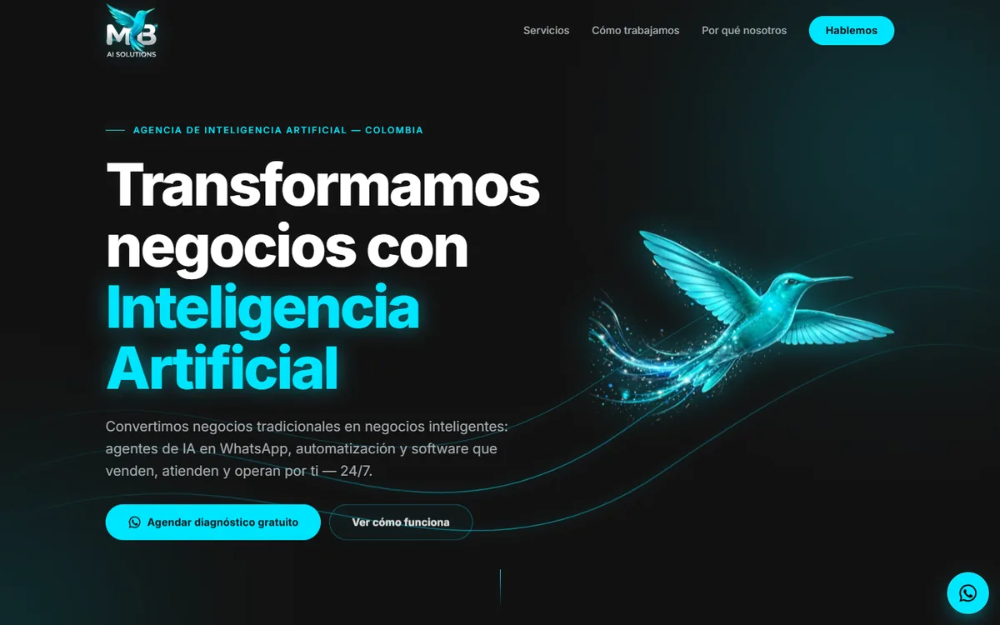
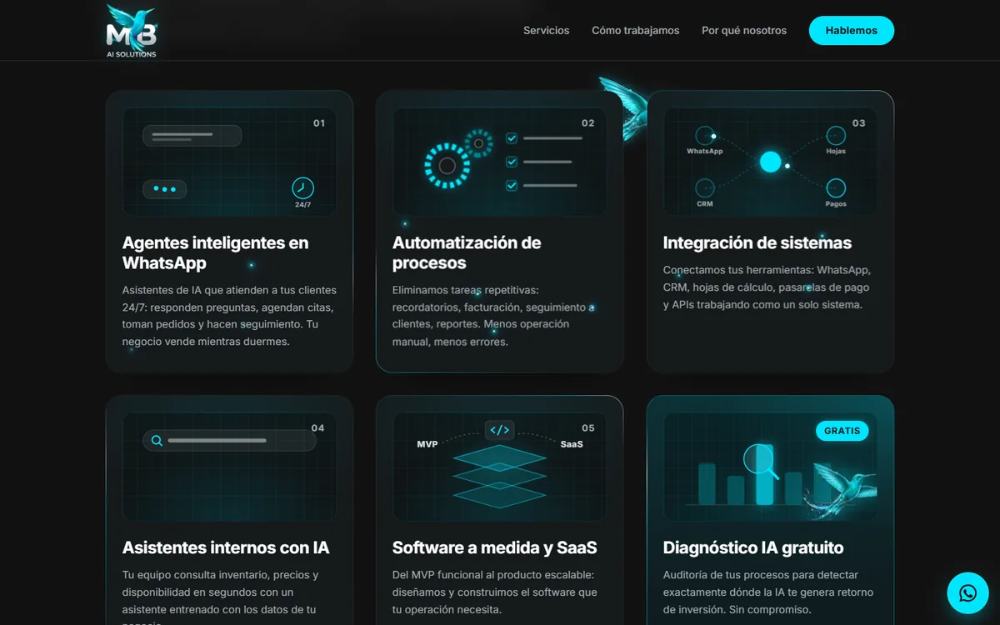
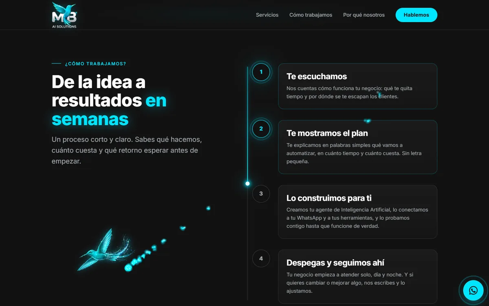
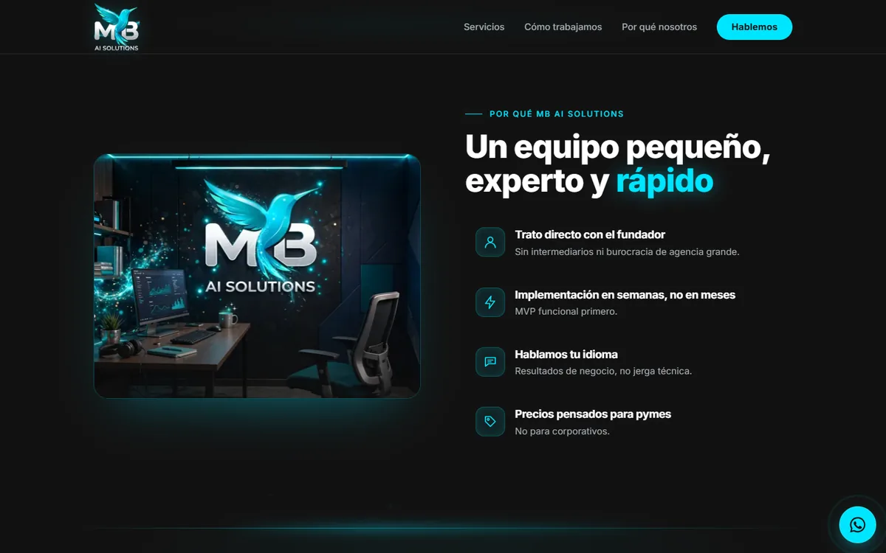
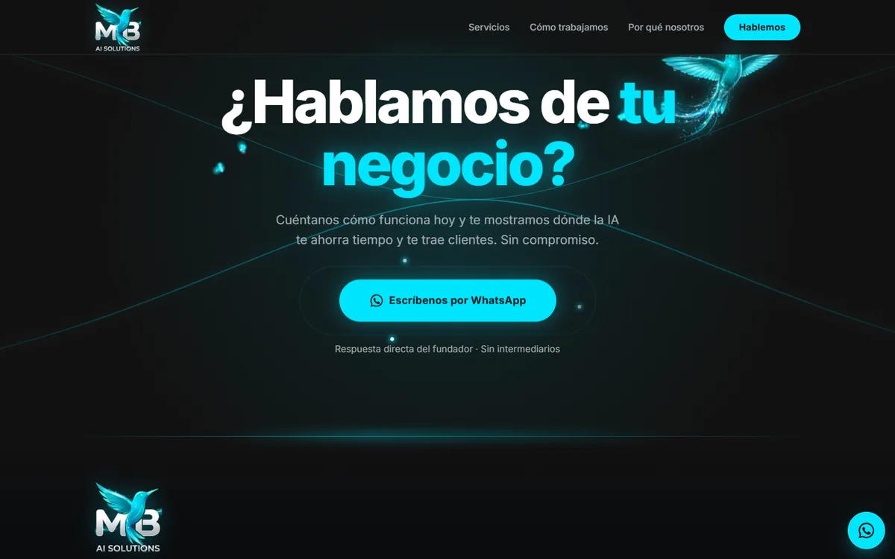
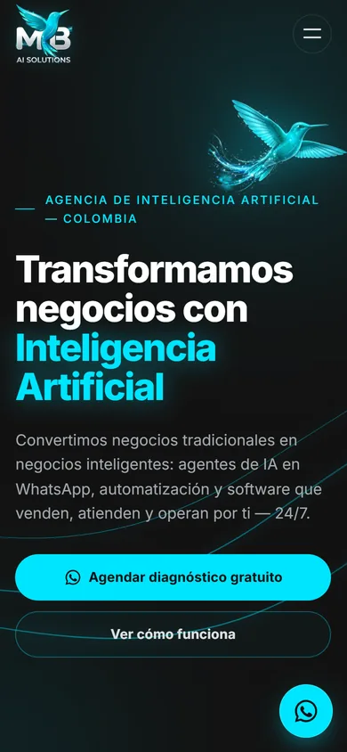
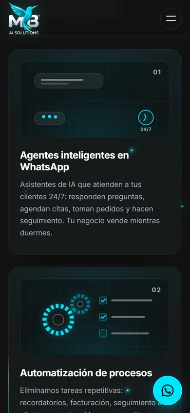

<div align="center">


# MB AI SOLUTIONS

**Transformamos negocios con Inteligencia Artificial.**

Agentes de IA en WhatsApp, automatización y software que venden, atienden y operan por tu negocio — 24/7.

[](https://mairon2812.github.io/mb-ai-solutions/)
[](https://wa.me/573025289834?text=Hola%20MB%20AI%20SOLUTIONS%2C%20quiero%20mi%20diagn%C3%B3stico%20gratuito)
[](PROPUESTA.md)

</div>

---

## La idea en 30 segundos

Muchos negocios tradicionales pierden clientes todos los días por algo simple: **no alcanzan a responder a tiempo en WhatsApp**, hacen todo a mano y saben que la tecnología les ayudaría, pero no saben por dónde empezar.

**MB AI SOLUTIONS** llega, diagnostica el negocio, implementa la solución en semanas y mide el retorno. No vendemos "inteligencia artificial" en abstracto: vendemos **resultados de negocio** — más ventas, menos costos operativos, atención 24/7 y procesos que funcionan solos.

> **Principio de la casa:** problema real → cliente real → MVP funcional → resultados medibles.
> Nada de proyectos gigantes sin usuarios.

📄 **¿Quieres el detalle completo?** Lee la [propuesta de negocio](PROPUESTA.md): problema, solución, cliente ideal, modelo de trabajo y hacia dónde vamos.

---

## Servicios

| | Servicio | Qué hace por tu negocio |
|:-:|---|---|
| 💬 | **Agentes inteligentes en WhatsApp** | Asistentes de IA que atienden a tus clientes 24/7: responden preguntas, agendan citas, toman pedidos y hacen seguimiento. Tu negocio vende mientras duermes. |
| ⚙️ | **Automatización de procesos** | Eliminamos tareas repetitivas: recordatorios, facturación, seguimiento a clientes, reportes. Menos operación manual, menos errores. |
| 🔗 | **Integración de sistemas** | Conectamos tus herramientas: WhatsApp, CRM, hojas de cálculo, pasarelas de pago y APIs trabajando como un solo sistema. |
| 🧠 | **Asistentes internos con IA** | Tu equipo consulta inventario, precios y disponibilidad en segundos con un asistente entrenado con los datos de tu negocio. |
| 🧩 | **Software a medida y SaaS** | Del MVP funcional al producto escalable: diseñamos y construimos el software que tu operación necesita. |
| 🔍 | **Diagnóstico IA gratuito** | Auditoría de tus procesos para detectar exactamente dónde la IA te genera retorno de inversión. Sin compromiso. |

**Nichos:** restaurantes · hoteles · clínicas · talleres · inmobiliarias · gimnasios · veterinarias · comercios · empresas de servicios y negocios locales.

## ¿Cómo trabajamos?

1. **Te escuchamos** — Nos cuentas cómo funciona tu negocio: qué te quita tiempo y por dónde se te escapan los clientes.
2. **Te mostramos el plan** — Te explicamos en palabras simples qué vamos a automatizar, en cuánto tiempo y cuánto cuesta. Sin letra pequeña.
3. **Lo construimos para ti** — Creamos tu agente de Inteligencia Artificial, lo conectamos a tu WhatsApp y a tus herramientas, y lo probamos contigo hasta que funcione de verdad.
4. **Despegas y seguimos ahí** — Tu negocio empieza a atender solo, día y noche. Y si quieres cambiar o mejorar algo, nos escribes y lo ajustamos.

## ¿Por qué MB AI SOLUTIONS?

- 🤝 **Trato directo con el fundador** — sin intermediarios ni burocracia de agencia grande.
- ⚡ **Implementación en semanas, no en meses** — MVP funcional primero.
- 🗣️ **Hablamos tu idioma** — resultados de negocio, no jerga técnica.
- 💰 **Precios pensados para pymes** — no para corporativos.
- 📈 **Acompañamiento post-implementación** — la IA se mide y se mejora.

---

## El sitio web

<p align="center">
  
</p>

<table>
  <tr>
    <td width="50%"></td>
    <td width="50%"></td>
  </tr>
  <tr>
    <td width="50%"></td>
    <td width="50%"></td>
  </tr>
</table>

<p align="center">
  
  &nbsp;&nbsp;
  
</p>

Una sola página con un solo objetivo: **que el visitante inicie una conversación por WhatsApp.** El colibrí — el alma de la marca — recorre toda la página siguiendo el scroll.

**Lo que tiene:**

- 🐦 **Vuelo del colibrí** por toda la página (GSAP MotionPath + ScrollTrigger) con estela de luz en canvas: mira hacia donde vuela, se inclina en las curvas y aterriza en el llamado final.
- ✨ **Tarjetas de servicios** que caen con estela y chispas, borde de luz giratorio y una escena animada por servicio.
- 🌊 **Smooth scroll** con Lenis sincronizado al ticker de GSAP.
- 🎯 **Cursor de luz** en escritorio: punto, anillo con inercia y polvo de estrellas.
- 📱 **Mobile-first**: vuelo más corto y menos partículas en el celular.
- ♿ **Accesible**: HTML semántico, foco visible, menú por teclado y soporte completo de `prefers-reduced-motion` (sin vuelo, partículas ni smooth scroll).
- ⚡ **Rendimiento**: solo se anima `transform` y `opacity`, las animaciones se pausan fuera de pantalla, imágenes en WebP y partículas cargadas en diferido.

### Stack


HTML, CSS y JavaScript vanilla — sin frameworks ni paso de build. Las librerías se cargan por CDN.

### Estructura

```
├── index.html          # Toda la página (SEO, Open Graph, secciones)
├── css/styles.css      # Design system en variables CSS + estilos
├── js/main.js          # Animaciones: preloader, reveals, tarjetas, vuelo, cursor
└── assets/img/         # Imágenes optimizadas en WebP (colibrí, logo, oficina, íconos)
```

### Ejecutarlo en local

```bash
git clone https://github.com/Mairon2812/mb-ai-solutions.git
cd mb-ai-solutions
python -m http.server 8000     # o: npx serve .
```

Abre `http://localhost:8000`. En VS Code también sirve la extensión **Live Server** (clic derecho en `index.html` → *Open with Live Server*).

---

## Identidad de marca

| Rol | Color | HEX |
|---|---|---|
| Primario | Turquesa brillante |  |
| Secundario | Verde azulado profundo |  |
| Acento | Plata metálico |  |
| Fondo | Azul marino oscuro |  |

**Tipografía:** Inter Bold (títulos) / Inter Regular (cuerpo).
**MB** tiene doble lectura: *Mairon Baron* (el origen) y *Modern Business* (hacia dónde crece la marca).

## Fundador

**Mairon Baron** — Ingeniero de Sistemas (Unisangil, Colombia). Especialista en IA aplicada, automatización y SaaS para negocios reales.

`Flutter/Dart` · `Laravel/PHP` · `PostgreSQL` · `Firebase` · `Python` · `n8n` · `Power Automate` · `APIs REST`

## Contacto

- 💬 **WhatsApp:** [+57 302 528 9834](https://wa.me/573025289834?text=Hola%20MB%20AI%20SOLUTIONS%2C%20quiero%20mi%20diagn%C3%B3stico%20gratuito)
- 🌐 **Web:** [mairon2812.github.io/mb-ai-solutions](https://mairon2812.github.io/mb-ai-solutions/)

<div align="center">

**¿Tu negocio pierde clientes por no responder a tiempo?**
[Hablemos por WhatsApp →](https://wa.me/573025289834?text=Hola%20MB%20AI%20SOLUTIONS%2C%20quiero%20mi%20diagn%C3%B3stico%20gratuito)

<sub>© 2026 MB AI SOLUTIONS — Todos los derechos reservados. Hecho con IA en Colombia ✦</sub>

</div>
