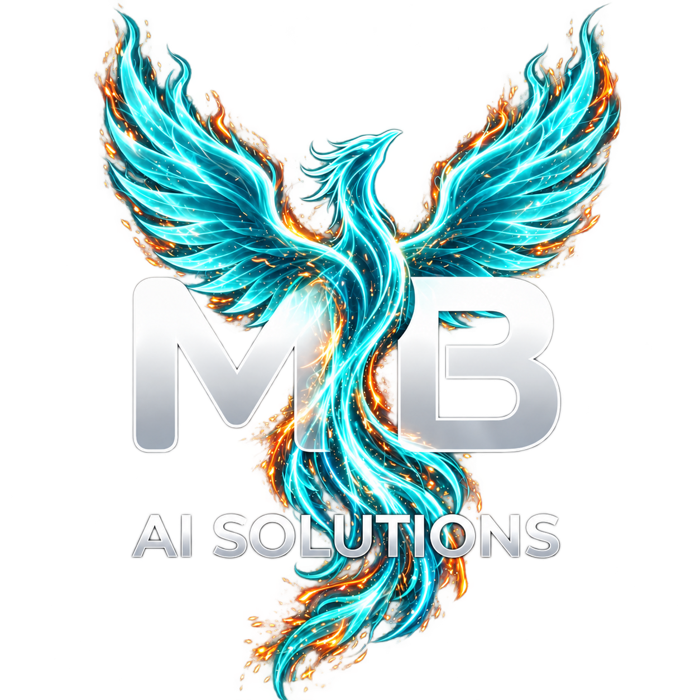

<div align="center">



# MB AI SOLUTIONS

**Transformamos negocios con Inteligencia Artificial.**

Diseñamos e implementamos agentes inteligentes, automatizaciones, integraciones y soluciones digitales adaptadas a las necesidades de cada negocio. Desde **Yopal, Casanare, Colombia**.

[](https://mairon2812.github.io/mb-ai-solutions/)
[](https://wa.me/573025289834?text=Hola%20MB%20AI%20SOLUTIONS%2C%20quiero%20solicitar%20un%20diagn%C3%B3stico%20para%20mi%20negocio.)
[](PROPUESTA.md)
[](https://mairon2812.github.io/mb-ai-solutions/#consola-ia)

</div>

---

**Actualizado: 2 de octubre de 2026.** Información comercial y técnica contrastada con la web y los archivos actuales del repositorio.

## En 30 segundos

**MB AI SOLUTIONS ayuda a negocios a automatizar y digitalizar su operación mediante IA, integraciones y desarrollo tecnológico.**

Muchos negocios pierden horas respondiendo las mismas preguntas, revisando inventarios a mano, copiando información entre herramientas o contestando mensajes fuera del horario. Nosotros **convertimos esos procesos repetitivos en flujos digitales e inteligentes**.

- **Mercado inicial:** pequeñas y medianas empresas de Yopal, Casanare — restaurantes, boutiques, tiendas, ferreterías, barberías y salones, inmobiliarias, negocios de servicios y comercios que quieren digitalizarse.
- **Presencia internacional:** versión de la web en inglés con precios de referencia en USD para Estados Unidos.
- **Producto principal:** **MB AI AGENT**, agentes inteligentes personalizados para empresas.
- **Siguiente paso:** [solicitar un diagnóstico](https://wa.me/573025289834?text=Hola%20MB%20AI%20SOLUTIONS%2C%20quiero%20solicitar%20un%20diagn%C3%B3stico%20para%20mi%20negocio.).

📄 **Detalle completo del modelo:** [propuesta de negocio](PROPUESTA.md).

---

## Producto principal: MB AI AGENT

Un agente inteligente personalizado para tu negocio que puede atender consultas, responder preguntas frecuentes, consultar información, capturar clientes, apoyar procesos comerciales y automatizar tareas repetitivas.

**Posibles aplicaciones:** atención al cliente · preguntas frecuentes · información de productos · precios · disponibilidad · catálogos · recepción de solicitudes · pedidos · captura de clientes · clasificación de conversaciones · seguimiento · transferencia a asesores humanos · atención fuera del horario comercial.

> Las funcionalidades se definen según las necesidades y el alcance de cada negocio.

**Desde $900.000 COP** · rango orientativo $900.000 – $2.500.000 COP · implementaciones avanzadas $2.500.000 – $5.000.000+ COP.

## Servicios complementarios

| Servicio | Qué hace | Desde |
|---|---|---|
| **Automatización de procesos** | Conectamos las herramientas que ya usa tu negocio para reducir tareas repetitivas. | $500.000 COP |
| **Digitalización de negocios** | Convertimos procesos manuales en sistemas digitales fáciles de administrar. | $500.000 COP |
| **Integraciones y conexiones** | Conectamos tus plataformas para que la información fluya automáticamente. | $400.000 COP |
| **Desarrollo de soluciones digitales** | Landing page desde $500.000 · web empresarial desde $1.000.000 · catálogo/e-commerce desde $1.500.000 · dashboard/sistema desde $2.000.000 · aplicación o sistema personalizado desde $3.000.000. | $500.000 COP |
| **Consultoría e implementación de IA** | Identificamos dónde la IA y la automatización generan mejoras reales. Diagnóstico inicial gratuito sujeto a disponibilidad. | $150.000 COP (diagnóstico) |
| **Soporte y optimización — MB AI CARE** | Mantenimiento, ajustes y mejoras mensuales. | $200.000 COP/mes |

## Paquetes

| Paquete | Para quién | Desde | Puede incluir |
|---|---|---|---|
| **START** | Negocios que están comenzando | $900.000 COP | Diagnóstico, digitalización básica, automatización sencilla, agente IA básico, integración inicial, capacitación |
| **BUSINESS** | Empresas que necesitan una solución más completa | $1.800.000 COP | Agente IA, automatizaciones, base de información, clientes, integraciones, flujos comerciales, reportes, capacitación |
| **CUSTOM** | Soluciones personalizadas | $3.000.000 COP | Agentes avanzados, múltiples automatizaciones, conexión con otros sistemas, bases de datos, dashboards, sistemas y aplicaciones |

**MB AI CARE** (soporte recurrente): BASIC desde $200.000 · BUSINESS desde $350.000 · PRO desde $600.000 COP/mes. Incluye distintos niveles de mantenimiento, ajustes, actualización de información, optimización, ajustes de agentes, mantenimiento de automatizaciones, revisión periódica y soporte técnico según el plan.

> **Sobre los precios:** son referencias para el mercado de Yopal. El precio final depende del alcance, la complejidad, las herramientas y las integraciones requeridas. Los servicios de terceros (proveedores de IA, WhatsApp/Meta, hosting, dominios, automatizadores, servicios en la nube) pueden generar costos adicionales según el proveedor y el nivel de uso, y se cobran por separado.
>
> **Plazos:** implementaciones normalmente de 1 a 4 semanas, dependiendo del alcance, la complejidad y las integraciones. El plazo definitivo se establece después del diagnóstico.

## Versión para Estados Unidos

La web publica referencias comerciales en USD; no realiza una conversión de divisas en tiempo real. Los importes se mantienen en `js/i18n.js`. La versión inglesa indica impuestos incluidos y mantiene los costos de terceros por separado.

| Oferta | Desde USD |
|---|---|
| MB AI AGENT / START | $419 |
| BUSINESS | $839 |
| CUSTOM | $1,379 |
| Automatización / digitalización / landing | $239 |
| Integraciones | $179 |
| Consultoría — diagnóstico | $69 |
| Web empresarial / e-commerce / dashboard / aplicación | $479 / $719 / $899 / $1,379 |
| MB AI CARE — BASIC / BUSINESS / PRO | $95 / $169 / $275 al mes |

MB AI AGENT: rango orientativo $419–$1,139; implementaciones avanzadas $1,139–$2,279+ USD. El alcance y la cotización final se acuerdan tras el diagnóstico.

## Cómo trabajamos

`01 Diagnóstico` → `02 Diseño` → `03 Implementación` → `04 Pruebas` → `05 Capacitación` → `06 Soporte`

1. **Diagnóstico** — entendemos cómo funciona actualmente tu negocio.
2. **Diseño** — identificamos qué procesos podemos digitalizar o automatizar.
3. **Implementación** — construimos y configuramos la solución.
4. **Pruebas** — validamos los flujos antes de ponerlos en funcionamiento.
5. **Capacitación** — enseñamos a tu equipo cómo utilizar el sistema.
6. **Soporte** — acompañamos la evolución de la solución.

## Sectores

🍽️ **Restaurantes** — pedidos, consultas, menú, horarios y atención ·
👗 **Boutiques** — productos, tallas, colores, precios y disponibilidad ·
🔧 **Ferreterías** — catálogos, referencias, disponibilidad y solicitudes ·
💈 **Barberías y salones** — citas, servicios, horarios y recordatorios ·
🏠 **Inmobiliarias** — captación y clasificación de prospectos ·
✦ **Otros negocios** — soluciones adaptadas a cada operación.

---

## El sitio web

Una sola página que funciona como **sitio web + catálogo de servicios + herramienta comercial + captador de leads**. Todos los llamados a la acción terminan en WhatsApp con un mensaje distinto según el origen (paquete, servicio o sección).

**Identidad actual:** fénix multicolor, intro en video y hero cinematográfico controlado por scroll. Las capturas anteriores de `.github/assets/` son históricas y no representan el diseño actual.

**Lo que tiene:**

- 🤖 **Consola IA real** ([pruébala](https://mairon2812.github.io/mb-ai-solutions/#consola-ia)): responde con Google Gemini, solo sobre MB AI SOLUTIONS, y arma un **plan de IA de 3 ideas** para el negocio del visitante con botón directo a WhatsApp. Si la IA no está disponible, usa respuestas preparadas.
- 🦋 **Mariposa Morpho guía:** vuela hacia la cámara con un letrero y se posa en la consola para invitar a usar la IA.
- 🔥 **Fénix animado:** intro con video y marco multicolor, secuencia de 80 frames HD en el hero y vuelo entre secciones con alas, cola y estela. La intro se puede saltar con el botón Entrar o Escape.
- 🌎 **Español/COP e inglés/USD:** selector CO/US visible también en móvil; detección inicial por zona horaria de Estados Unidos, preferencia guardada y enlaces `?lang=es` / `?lang=en`.
- ✨ **Tarjetas de servicios** que caen con chispas y escenas animadas; conversación de ejemplo de MB AI AGENT.
- 🌊 **Océano cibernético** en el footer que reacciona al puntero.
- 📱 **Mobile-first**, ♿ **accesible** (teclado, lectores de pantalla y `prefers-reduced-motion`) y ⚡ **liviana** (animaciones adaptadas al movimiento reducido, caché de frames limitada e imágenes WebP).

### Stack


HTML, CSS y JavaScript vanilla, sin paso de build; librerías por CDN. La IA pasa por un Cloudflare Worker que guarda la clave de Gemini como secreto, limita el uso por visitante y solo acepta peticiones desde la web.

### Estructura

```
├── index.html            # Toda la página (SEO, secciones, precios, CTAs)
├── css/                  # styles.css, phoenix.css e intro-universe.css
├── js/
│   ├── main.js           # Animaciones, tarjetas, vuelo del fénix y cursor
│   ├── phoenix.js        # Intro en video y secuencia del hero
│   ├── i18n.js           # Idioma, precios COP/USD y mensajes regionales
│   ├── console.js        # Consola IA (Gemini vía Worker + respuestas de respaldo)
│   ├── guide.js          # Mariposa Morpho guía hacia la consola
│   └── sea.js            # Océano cibernético del footer
├── worker/               # Cloudflare Worker: proxy seguro hacia Gemini
│   ├── src/index.js
│   └── wrangler.toml
├── assets/               # Logos fénix, video, frames y recursos visuales
└── PRUEBAS-FENIX.md       # Verificación manual de la experiencia actual
```

### Ejecutarlo en local

```bash
git clone https://github.com/Mairon2812/mb-ai-solutions.git
cd mb-ai-solutions
python -m http.server 5510     # o: npx serve .
```

Abre `http://localhost:5510`. Con VS Code también sirve la extensión **Live Server** (puerto 5500).

**Worker de la IA** (opcional, para desplegar tu propia versión):

```bash
cd worker
npm install
npx wrangler login
npx wrangler secret put GEMINI_API_KEY   # pega la clave cuando la pida
npx wrangler deploy
```

---

### Validación y publicación

Consulta [PRUEBAS-FENIX.md](PRUEBAS-FENIX.md) para comprobar intro, scroll, móvil, movimiento reducido y fallos de carga. Verifica ambos idiomas antes de publicar. GitHub Pages sirve los archivos estáticos; el Worker de IA se despliega de forma independiente. El código del proxy no confirma por sí solo la disponibilidad del servicio remoto.

## Identidad de marca

| Rol | Color | HEX |
|---|---|---|
| Primario | Turquesa brillante |  |
| Secundario | Verde azulado profundo |  |
| Acento | Plata metálico |  |
| Fondo | Azul marino oscuro |  |

**Símbolo:** fénix, asociado al renacer y la transformación de los negocios. Logo principal multicolor: `assets/logo-fenix-fullcolor-transparente.png`; variante turquesa: `assets/logo-fenix-turquesa-transparente.png`. Fondo navy con luces turquesa, azul, violeta y ámbar.

**Tipografía:** Inter Bold / Inter Regular. **MB** = *Mairon Baron* (el origen) y *Modern Business* (hacia dónde crece la marca).

## Fundador

**Mairon Baron** — Ingeniero de Sistemas (Unisangil, Colombia). IA aplicada, automatización y desarrollo de soluciones digitales para negocios reales.

## Contacto

- 💬 **WhatsApp:** [+57 302 528 9834](https://wa.me/573025289834?text=Hola%20MB%20AI%20SOLUTIONS%2C%20quiero%20solicitar%20un%20diagn%C3%B3stico%20para%20mi%20negocio.)
- 📍 **Ubicación:** Yopal, Casanare, Colombia
- 🌐 **Web:** [mairon2812.github.io/mb-ai-solutions](https://mairon2812.github.io/mb-ai-solutions/)

<div align="center">

**¿Cuánto tiempo pierde tu negocio en tareas que podrían automatizarse?**
[Solicitar diagnóstico →](https://wa.me/573025289834?text=Hola%20MB%20AI%20SOLUTIONS%2C%20quiero%20solicitar%20un%20diagn%C3%B3stico%20para%20mi%20negocio.)

<sub>© 2026 MB AI SOLUTIONS — Todos los derechos reservados. Desarrollo con AI ✦</sub>

</div>
